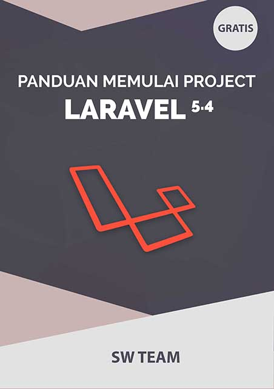

<h1 align="center">The Larakod</h1>

## About Larakod

Larakod merupakan contoh aplikasi web yang dibuat dengan php framework Laravel 5.4, merupakan bagian dari e-book (source code) **Panduan Memulai Project Laravel 5.4**.

## How Installing larakod 

Setelah Anda mendapatkan Larakod, ikuti langkah-langkah berikut untuk melakukan installasi :
1. Jalankan `composer install` untuk menginstall dependencies Laravel.
2. Jalankan perintah `cp .env.example .env` untuk generate file .env
3. Jalankan perintah `php artisan key:generate` untuk generate key.
4. Buat database baru, kemudian buka file `.env` Atur username, password, dan nama database.
5. Jalankan perintah `php artisan migrate`
6. Jalankan perintah `php artisan db:seed`
7. Jalankan perintah `php artisan serve`
8. Buka Browser, ketik `localhost:8000`
9. Gunakan username: `admin@larakod.com` dan password: `admin123` untuk login sebagai Admin

## License

Larakod bersifat open source dan free dengan menggunakan [MIT license](http://opensource.org/licenses/MIT).
